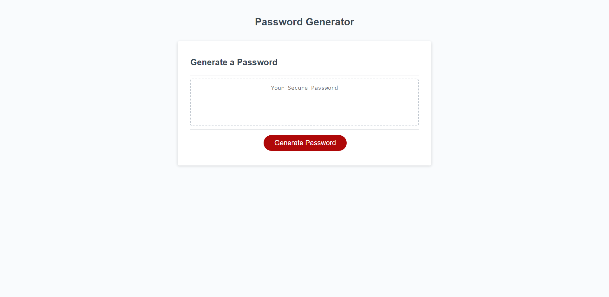

# Password Generator - Module 3 Challenge

- [LINK TO WEBSITE](https://seejayee.github.io/password-generator/)

## Description

- This module challenge challenges me to finish the JavaScript code for a password generator project. This project contains a website with a button and a text area. Throughout this project, I used what I learned from the corresponding module and used functions, objects, and methods to complete the JavaScript code.

## Installation

- Not applicable.

## Usage 

- WHEN the user clicks on the button, they begin generating a password through a series of prompts.
- The user must enter a desired password length (length from 8 to 128 characters).
- The user must decide if they want lowercase characters in their password.
- The user must decide if they want uppercase characters in their password.
- The user must decide if they want numerical characters in their password.
- The user must decide if they want special characters in their password.
- The generated password -- with the accepted character types -- is generated onto the page.

- IF the user selects a character length outside of the permitted range, they are given an error and must try again until they select within the range.
- IF the user doesn't select a character type for their password, they are given an error and must try again until they pick one.

## License

- MIT License